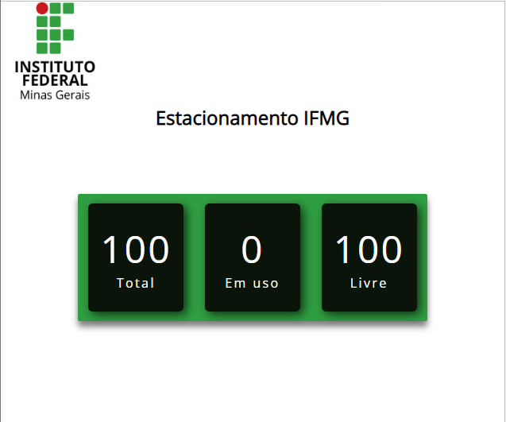

# Parking-Dashboard

Interface web para visualização da quantidade de veículos em um estacionamento em tempo real através de requisições HTTP GET ao servidor local.

## Pré-requisitos para testar a aplicação

O servidor deve estar rodando localmente.

O link abaixo direciona para o respositório onde o projeto se encontra: [Servidor](https://github.com/FredericoFirmo/Estacionamento-API).

## Execução do programa

Rode o arquivo index.html para iniciar a tela de monitoramento.

## Resultado esperado:

